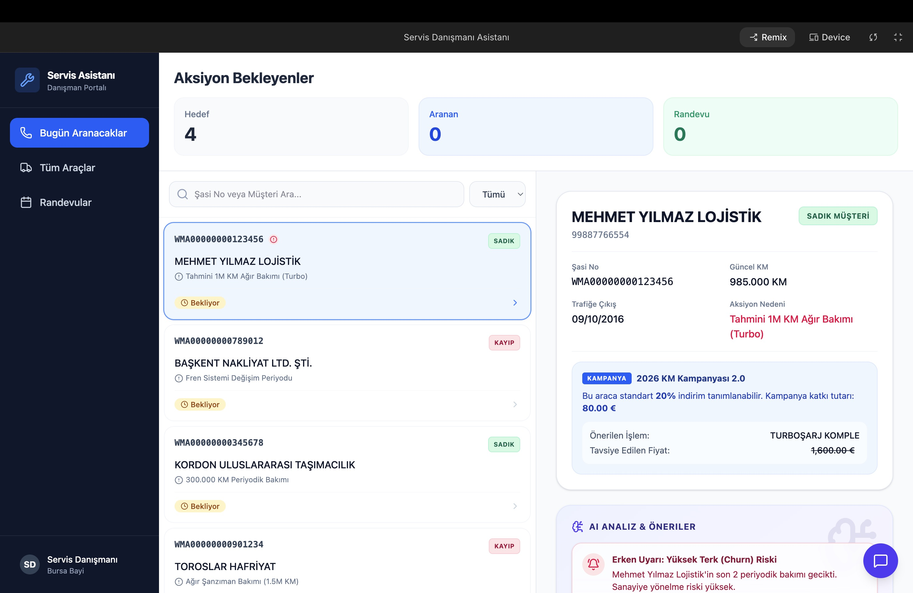
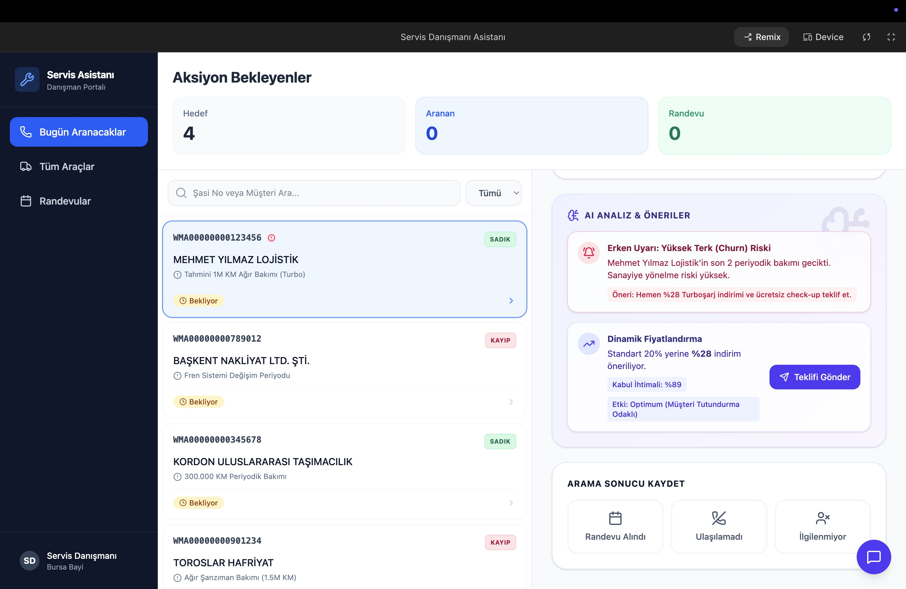
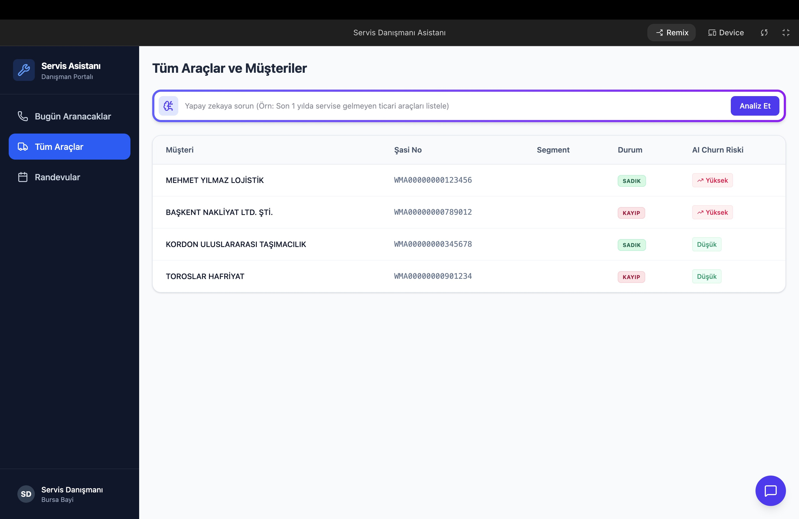
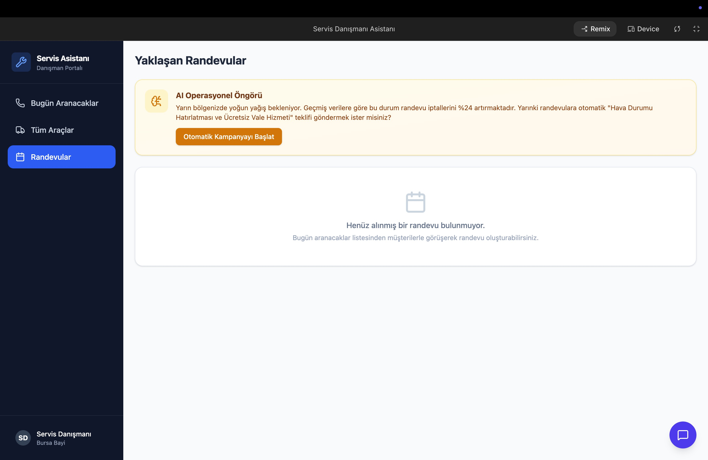

# 🚀 RTT SmartPortal: AI Destekli Servis Danışmanı Asistanı
 Servis Danışmanları için özel olarak geliştirilmiş, **gelişmiş yapay zeka (AI)** gücünü arkasına alan, yeni nesil ve akıllı bir danışman portalı. 

Bu asistan, klasik bir müşteri ve araç listeleme ekranının çok ötesindedir. İçerdiği yapay zeka algoritmaları sayesinde müşteri verilerini analiz eder, riskleri önceden belirler ve karlılığı artıracak aksiyon önerilerinde bulunur.

---

## 📸 Ekran Görüntüleri

Uygulama arayüzünden çeşitli kesitler:






---

## 🧠 Akıllı Yapay Zeka Özellikleri (AI Features)

Projeye entegre olan ve servis yöneticilerinin/danışmanlarının yükünü hafifleten başlıca yapay zeka yetenekleri:

### 1. 🚨 Erken Uyarı: Yüksek Terk (Churn) Riski Tahmini
Sistem, müşterinin servise geliş sıklığı, yaşı, son işlem tarihi ve araç segmenti gibi verileri yapay zeka ile işleyerek **Müşteri Kaybı (Churn)** riskini hesaplar.
- Risk düzeyi yüksek olan müşterileri özel olarak etiketler.
- Durumu tersine çevirmek için danışmana özel "Aksiyon Önerisi" (Örn: Ücretsiz Check-up + Motor Yağında İndirim) sunar.

### 2. 📉 Dinamik Fiyatlandırma (Dynamic Pricing)
Klasik "herkese standart indirim" mantığı yerine kişiselleştirilmiş teklifler sunar.
- Müşterinin sadakat durumu ve işlemi kabul ihtimalini yüzdesel olarak hesaplar.
- Sadece teklifin onaylanmasını sağlayacak *optimum indirim oranını* önererek gereksiz indirimlerin (ve kâr kaybının) önüne geçer.

### 3. 🌤️ Operasyonel Öngörü ve Proaktif Kampanyalar (Operational Forecast)
Dış etkenleri (hava durumu, trafik, vb.) geçmiş randevu iptal verileriyle sentezler.
- Örn: "Yarınki yağışlı havanın iptalleri %24 artırabileceğini" tespit eder.
- Çözüm olarak danışmana tek tıkla "Hava Durumu Hatırlatması ve Ücretsiz Vale Hizmeti" kampanyası başlatma opsiyonu sunar.

### 4. 💬 AI Chat Asistanı (Doğal Dil ile Veri Sorgulama)
Danışmanlar karmaşık ekranlar arasında kaybolmak yerine ekranın sağ altındaki "AI Asistanı" ile yazışabilir.
- *"Bugün kimi aramalıyım?"* sorusuna, algoritmanın belirlediği yüksek riskli müşteriler listesiyle cevap verir.
- Veritabanındaki binlerce satır veriyi saniyeler içinde doğal dil formatında özetler ve operasyonu yönlendirir.

---

## 💻 Kurulum (Local Development)

Projeyi bilgisayarınızda yerel ortamda çalıştırmak için aşağıdaki adımları takip edebilirsiniz:

1. Bağımlılıkları yükleyin:
   ```bash
   npm install
   ```

2. Uygulamayı başlatın:
   ```bash
   npm start
   ```

Uygulamanız standart olarak `http://localhost:3000` portunda çalışacaktır.

---

## 🌍 Yayınlama (Deployment)

Projenin derleme ve yayınlama işlemleri CI/CD boru hatları (pipeline) aracılığıyla yönetilmek üzere yapılandırılmıştır. `main` dalına yapılan güncellemelerle birlikte otomatik olarak sunucuya yansıtılır.
